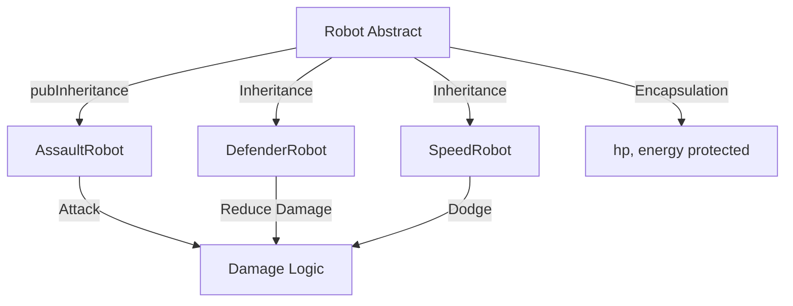

# 📌 [Tên Module: Robot Battle Game - OOP & Collections]

---

## 1. Tổng quan & Mục tiêu (The Goal)

* **Vấn đề giải quyết:**

  * Code game dễ bị:

    * if-else theo type (anti-OOP)
    * dữ liệu bị sửa bừa (hp âm, energy âm)
    * logic battle dính cứng vào class cụ thể
  * OOP giúp:

    * tổ chức code rõ ràng
    * tái sử dụng logic
    * dễ mở rộng thêm robot/skill

* **Mục tiêu cá nhân:**

  * Thiết kế class chuẩn OOP (abstract + inheritance)
  * Hiểu rõ encapsulation qua validate state
  * Áp dụng polymorphism (không instanceof)
  * Biết dùng `List`, `Map` để quản lý game state

---

## 2. Tư duy thiết kế & Đối tượng bảo vệ (Design & Safety)

### A. Đối tượng cần bảo vệ (What to protect?)

* **Dữ liệu nhạy cảm:**

  * `hp` → không được < 0
  * `energy` → không được < 0
  * `isAlive` → phải sync với hp
  * `cooldownSkill`

* **Tính toàn vẹn:**

  * Robot chết thì không được attack
  * Không được dùng skill khi không đủ energy
  * 1 lượt chỉ thực hiện 1 action hợp lệ

---

### B. Cơ chế bảo vệ (How to protect?)

* **Kỹ thuật sử dụng:**

  * Encapsulation (private field)
  * Method control:

    * `takeDamage()`
    * `consumeEnergy()`
  * Validation logic trong method
  * Optional: `final` cho immutable field (id, name)

* **Lý do chọn:**

  * Tránh việc sửa trực tiếp field gây bug logic
  * Tập trung rule vào 1 nơi → dễ maintain
  * Gần giống cách backend xử lý domain entity

---

## 3. Sơ đồ tư duy (Logic Diagram)

---

## 4. Khả năng mở rộng & Linh hoạt (Extensibility)

* **Sự phụ thuộc (Dependencies):**

  * Dùng `abstract class Robot` thay vì concrete class
  * Game logic chỉ phụ thuộc `Robot` → không phụ thuộc class con

* **Nguyên tắc SOLID áp dụng:**

  * **Open/Closed:**

    * Thêm robot mới → chỉ cần tạo class mới
    * Không sửa battle logic
  * **Liskov Substitution:**

    * Mọi Robot đều dùng chung qua reference `Robot`
  * **Single Responsibility:**

    * Robot → giữ state + behavior
    * BattleService → điều khiển trận đấu

* **Dự đoán tương lai:**

  * Thêm:

    * Skill mới → chỉ override method
    * Robot mới → không ảnh hưởng code cũ
    * Multiplayer → reuse battle engine

---

## 5. Kiểm chứng & Đo lường (Validation & Benchmarking)

* **Unit Tests cốt lõi:**

  * attack giảm hp đúng
  * hp không < 0
  * không attack khi chết
  * skill fail khi thiếu energy
  * Defender giảm damage đúng
  * SpeedRobot có thể dodge

* **Kết quả đo lường (nếu có):**

  * So sánh:

    * if-else vs polymorphism
  * Memory:

    * đảm bảo không giữ reference thừa (List clear đúng)

* **Trạng thái đối tượng:**

  * Luôn đảm bảo:

    * `hp >= 0`
    * `isAlive == (hp > 0)`

---

## 6. Những câu hỏi "Tại sao?" (The "Why" Questions)

* **Q1:** Tại sao không dùng if-else theo type?

  * → Khó mở rộng, vi phạm OCP

* **Q2:** Điều gì xảy ra nếu bỏ encapsulation?

  * → Có thể set hp = -100 → bug game logic

* **Q3:** Giải pháp này có tốn tài nguyên hơn không?

  * → Không đáng kể, đổi lại code maintainable hơn rất nhiều

---

## 7. Tổng kết & Action Items

* **Key Takeaway:**

  * “OOP không phải để viết cho đẹp, mà để kiểm soát sự thay đổi.”

* **Ứng dụng:**

  * Áp dụng vào:

    * Project backend (entity + service)
    * System design nhỏ (task, user, role)

* **Lỗ hổng còn lại:**

  * Chưa rõ:

    * Khi nào dùng interface vs abstract class
    * Khi nào cần design pattern (Strategy, Factory)
