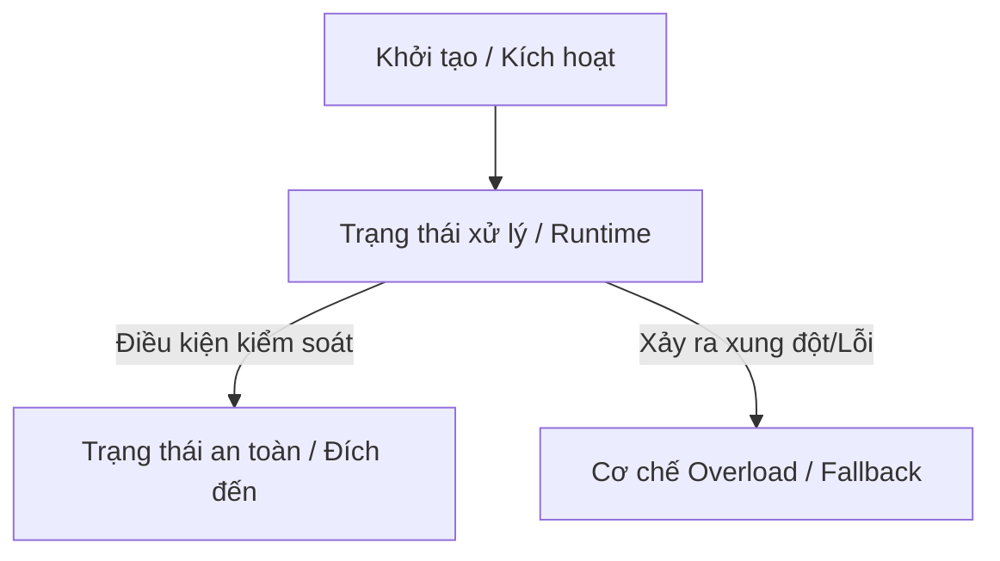

# 📌 [Tên Module: Ví dụ: Concurrency, OOP, Spring Beans...]

## 1. Động lực & Mục tiêu (The Motivation)
*Phần này giúp bạn định vị "nỗi đau" và lý do công nghệ/kiến thức này ra đời.*

- **Bối cảnh & Vấn đề:** (Tại sao cần kiến thức này? Nếu không có nó, hệ thống sẽ gặp thảm họa gì? Ví dụ: Race condition làm sai lệch số dư, Over-engineering khi cấu trúc code...)
- **Mục tiêu cốt lõi:** (Sau module này, tôi làm chủ được kỹ năng gì? Tự tin giải quyết bài toán nào?)

## 2. Quy tắc cuộc chơi & Trạng thái an toàn (Core Rules & Safety)
*Mọi module đều có quy tắc để giữ cho nó "sống" và "đúng".*

### A. Trạng thái cần duy trì (What to keep safe?)
- **Tính toàn vẹn dữ liệu / Thread-Safety:** (Ví dụ với OOP: Không có máu âm; Với Thread: Biến đếm không bị ghi đè; Với Collections: Không bị ConcurrentModificationException).
- **Giới hạn tài nguyên (Resource Constraints):** (Ví dụ: Không để tràn bộ nhớ/OOM, không tạo quá nhiều Thread gây nghẽn CPU).

### B. Cơ chế kiểm soát (How to control?)
- **Giải pháp kỹ thuật sử dụng:** (Ví dụ: Encapsulation cho OOP, ReentrantLock/Atomic cho Thread, Immutable Object cho cấu trúc dữ liệu).
- **Đánh đổi (Trade-offs):** (Tại sao chọn cách này? Nó giúp an toàn hơn nhưng có làm code phức tạp hơn hay giảm hiệu năng đi một chút không?)

## 3. Kiến trúc & Luồng vận hành (Architecture & Lifecycle)
*Không chỉ bó hẹp ở sơ đồ lớp (Class), mà mở rộng ra luồng xử lý hoặc vòng đời của đối tượng.*

*(Gợi ý vẽ: Nếu là OOP -> Vẽ quan hệ giữa các Class; Nếu là Thread/Spring -> Vẽ Vòng đời (Lifecycle) hoặc Luồng dữ liệu (Data flow)).*

## 4. Tư duy dài hạn: Linh hoạt & Hiệu năng (Extensibility & Performance)
*Chứng minh giải pháp này chạy tốt ở hiện tại và sẵn sàng cho tương lai.*

- **Mức độ đóng gói / Phụ thuộc:** (Code có bị dính chặt vào một thư viện/class cụ thể nào không? Có dễ thay thế hoặc tách module không?)
- **Khả năng mở rộng (Scalability):** (Nếu lượng dữ liệu tăng gấp 10, hoặc số lượng request tăng gấp 100, thiết kế này sẽ phản ứng thế nào? Có bị bottleneck/nghẽn ở đâu không?)
- **Nguyên lý cốt lõi áp dụng:** (SOLID, Clean Architecture, hoặc các Concurrency Design Patterns...).

## 5. Thực nghiệm & Biện hộ (Validation & Proof)
*Dùng thực tế để chứng minh lý thuyết đúng.*

- **Kịch bản kiểm thử (Test Cases):** (Các trường hợp biên, trường hợp dị thường để test độ bền của code. Ví dụ: Giả lập 100 threads cùng ghi vào 1 tài khoản).
- **Dấu hiệu nhận biết "Hệ thống khỏe mạnh":** (Làm sao biết code đang chạy đúng chuẩn? Ví dụ: Không có lỗi Exception trong log, CPU không nhảy lên 100%, bộ nhớ giải phóng đều đặn).

## 6. Câu hỏi phản biện (The "Why" Questions)
*Dùng để tự vấn, chuẩn bị cho phỏng vấn Senior.*

- **Q1:** Có giải pháp thay thế nào dễ làm hơn không? Tại sao tôi lại từ chối nó để chọn cách này?
- **Q2:** Điểm yếu chí mạng của giải pháp tôi vừa chọn là gì? (Ví dụ: Dùng synchronized thì chậm, dùng Atomic thì tốn bộ nhớ khi vòng lặp quá nhiều...).
- **Q3:** Nếu một Junior vào đọc code này, họ dễ làm sai ở chỗ nào nhất?

## 7. Đúc kết hành động (Action Items)
- **Bài học tâm đắc (Insight):** (1 câu ngắn gọn thay đổi tư duy của bạn sau module này).
- **Điểm sáng áp dụng:** (Tôi sẽ đem ngay tư duy này áp dụng vào tính năng nào/dự án nào đang làm?)
- **Vùng mờ (The Blindspot):** (Phần nâng cao nào của module này tôi tạm thời gác lại hoặc cần đào sâu sau? Ví dụ: Chưa tối ưu sâu xuống tầng OS...).