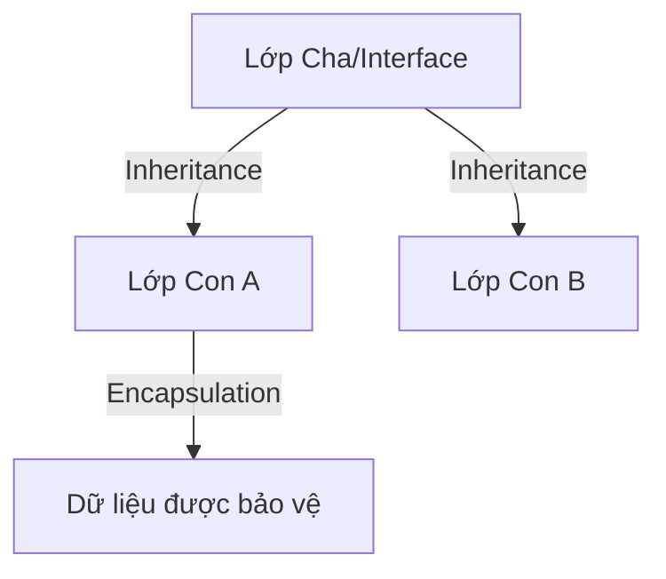

# 📌 [Tên Module: Ví dụ OOP, Collections...]

## 1. Tổng quan & Mục tiêu (The Goal)

- **Vấn đề giải quyết:** (Tại sao cần kiến thức này? Nó giải quyết nỗi đau gì?)
- **Mục tiêu cá nhân:** (Tôi muốn đạt được kỹ năng gì sau bài tập này?)

## 2. Tư duy thiết kế & Đối tượng bảo vệ (Design & Safety)

_Đây là phần quan trọng nhất để chống học vẹt._

### A. Đối tượng cần bảo vệ (What to protect?)

- **Dữ liệu nhạy cảm:** (Ví dụ: Biến `hp` trong OOP, biến `balance` trong Bank, `SharedState` trong Thread).
- **Tính toàn vẹn:** (Ví dụ: Không cho phép máu âm, không cho phép Key trong Map bị trùng).

### B. Cơ chế bảo vệ (How to protect?)

- **Kỹ thuật sử dụng:** (Ví dụ: Encapsulation, `synchronized`, `final` keyword, Validation logic).
- **Lý do chọn:** (Tại sao cách này là tối ưu nhất cho bài toán này?)

## 3. Sơ đồ tư duy (Logic Diagram)

## 4. Khả năng mở rộng & Linh hoạt (Extensibility)
*Phần này chứng minh bạn không chỉ làm cho chạy được mà còn làm cho dễ sửa.*

- **Sự phụ thuộc (Dependencies):** (Tôi đang dùng Interface hay Class cụ thể? Tại sao?)
- **Nguyên tắc SOLID áp dụng:** - (Ví dụ: Áp dụng Open/Closed để thêm nhân vật mới mà không sửa logic chiến đấu).
    - (Ví dụ: Dependency Inversion để dễ dàng thay đổi loại Database/Storage).
- **Dự đoán tương lai:** (Nếu khách hàng muốn thêm tính năng X, cấu trúc này sẽ phản ứng thế nào?)

## 5. Kiểm chứng & Đo lường (Validation & Benchmarking)
*Dùng số liệu và thực tế để khẳng định thiết kế đúng.*

- **Unit Tests cốt lõi:** (Liệt kê các trường hợp test quan trọng nhất).
- **Kết quả đo lường (nếu có):** - (Ví dụ: So sánh thời gian chạy giữa 2 cách triển khai bằng JMH).
    - (Ví dụ: Chụp ảnh VisualVM để chứng minh không bị Memory Leak).
- **Trạng thái đối tượng:** (Làm sao biết đối tượng vẫn "khỏe mạnh" trong suốt vòng đời?)

## 6. Những câu hỏi "Tại sao?" (The "Why" Questions)
*Dùng để ôn tập nhanh hoặc trả lời phỏng vấn.*

- **Q1:** Tại sao không dùng [Cách A] mà lại dùng [Cách B]?
- **Q2:** Điều gì xảy ra nếu cơ chế bảo vệ ở mục 2.B bị tắt đi?
- **Q3:** Giải pháp này có tốn tài nguyên (CPU/RAM) hơn bình thường không?

## 7. Tổng kết & Action Items
- **Key Takeaway:** (1 câu tâm đắc nhất sau khi xong module này).
- **Ứng dụng:** (Tôi sẽ áp dụng kiến thức này vào dự án hoặc công việc như thế nào?)
- **Lỗ hổng còn lại:** (Những gì tôi vẫn chưa hiểu rõ và cần tìm hiểu thêm).