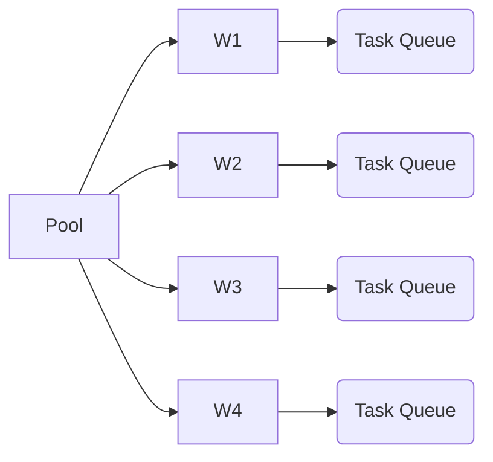
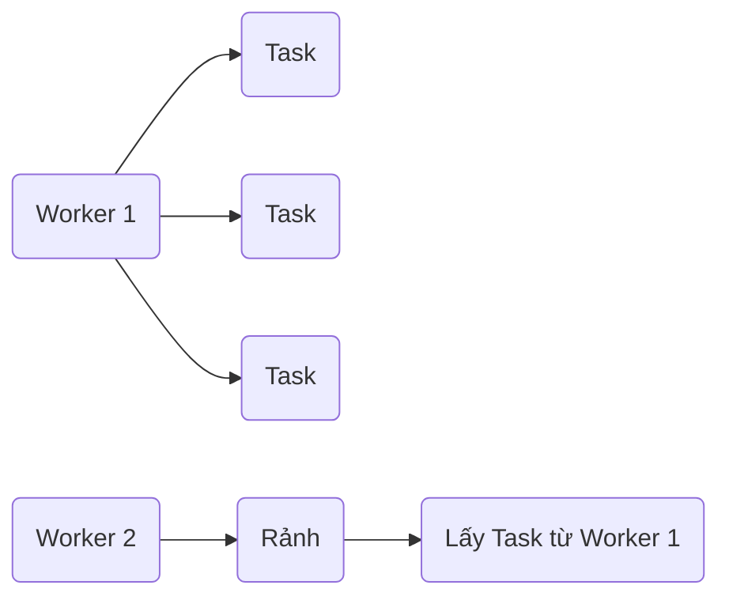

# 📌 ForkJoinPool (Java Concurrency)

## 1. Động lực & Mục tiêu (The Motivation)

### Bối cảnh & Vấn đề

ForkJoinPool ra đời để giải quyết bài toán **CPU-bound** có thể chia nhỏ thành nhiều phần độc lập.

Nếu chỉ dùng một Thread:

- CPU chỉ sử dụng 1 Core.
- Những Core còn lại gần như không làm gì.
- Thời gian xử lý tăng tuyến tính theo kích thước dữ liệu.

Ví dụ:

- Tính tổng 1 tỷ số.
- Merge Sort.
- Quick Sort.
- Duyệt cây (Tree Traversal).
- Xử lý ảnh.
- Machine Learning preprocessing.

Nếu dùng ThreadPoolExecutor thông thường:

- Có một hàng đợi (Queue) chung.
- Một Thread quá bận trong khi Thread khác rảnh vẫn không tự cân bằng được công việc.
- Hiệu suất CPU không tối ưu.

ForkJoinPool giải quyết bằng:

- Chia nhỏ Task (Fork)
- Chạy song song
- Ghép kết quả (Join)
- Work Stealing giúp cân bằng tải giữa các Worker.

---

### Mục tiêu cốt lõi

Sau module này cần làm chủ được:

- Hiểu cơ chế Divide & Conquer.
- Viết RecursiveTask.
- Viết RecursiveAction.
- Hiểu Work Stealing.
- Biết khi nào nên và không nên dùng ForkJoinPool.
- Hiểu CompletableFuture mặc định chạy trên ForkJoinPool.commonPool().

---

# 2. Quy tắc cuộc chơi & Trạng thái an toàn (Core Rules & Safety)

## A. Trạng thái cần duy trì

### Thread Safety

Mỗi Task phải độc lập.

Không nên:

- sửa chung biến global
- ghi cùng Collection không đồng bộ
- thay đổi trạng thái dùng chung

Nên:

- Immutable Object
- Local Variable
- Atomic
- Concurrent Collection

---

### Giới hạn tài nguyên

ForkJoinPool sinh rất nhiều Task.

Nếu chia quá nhỏ:

```text
1 Task

↓

1000 Task

↓

100000 Task
```

chi phí quản lý Task còn lớn hơn chi phí tính toán.

=> luôn cần Threshold.

Ví dụ:

```java
if(length <= 1000){
    xử lý trực tiếp
}
```

---

## B. Cơ chế kiểm soát

### RecursiveTask

Có giá trị trả về.

```java
class SumTask extends RecursiveTask<Long>
```

---

### RecursiveAction

Không trả về.

```java
class SortTask extends RecursiveAction
```

---

### Fork

Chia Task.

```java
left.fork();
```

---

### Compute

Thread hiện tại tự xử lý.

```java
right.compute();
```

---

### Join

Đợi kết quả.

```java
left.join();
```

---

### Trade-offs

Ưu điểm

- tận dụng CPU
- tự cân bằng tải
- scale tốt

Nhược điểm

- Code phức tạp hơn ThreadPoolExecutor.
- Không phù hợp Blocking IO.
- Recursive quá nhiều gây overhead.

---

# 3. Kiến trúc & Luồng vận hành (Architecture & Lifecycle)

```mermaid
graph TD

A(Task lớn)

A --> B{Đủ nhỏ?}

B -->|Có| C[Xử lý trực tiếp]

B -->|Không| D[Fork]

D --> E[left.fork()]

D --> F[right.compute()]

F --> G[left.join()]

G --> H[Ghép kết quả]

H --> I[Return]
```

---

## Kiến trúc Worker



Mỗi Worker có Queue riêng.

---

## Work Stealing



Worker rảnh sẽ tự động lấy Task của Worker khác.

Không cần Queue chung.

---

# 4. Tư duy dài hạn: Linh hoạt & Hiệu năng (Extensibility & Performance)

## Mức độ đóng gói

Task độc lập.

Mỗi Task chỉ biết:

- dữ liệu của mình
- kết quả của mình

Không phụ thuộc Task khác.

=> Coupling thấp.

---

## Khả năng mở rộng

Ví dụ:

CPU

```text
4 Core
```

ForkJoinPool

```text
4 Worker
```

Nếu máy:

```text
32 Core
```

ForkJoinPool có thể tạo khoảng:

```text
32 Worker
```

=> gần như scale tuyến tính với số Core.

---

## Bottleneck

Không nên dùng cho

- JDBC
- HTTP
- File
- Socket

vì Thread sẽ Block.

Lúc đó Work Stealing không giúp nhiều.

---

## Nguyên lý áp dụng

- Divide and Conquer
- Work Stealing
- Recursive Decomposition
- CPU Parallelism

---

# 5. Thực nghiệm & Biện hộ (Validation & Proof)

## Test Cases

### Case 1

Tính tổng

```text
100 phần tử
```

không chia Task.

---

### Case 2

```text
10 triệu phần tử
```

Fork thành nhiều Task.

Kiểm tra:

- đúng kết quả
- nhanh hơn

---

### Case 3

Machine

```text
16 Core
```

CPU Usage

mong muốn

```text
80~100%
```

---

### Case 4

Threshold

100

vs

1000

vs

10000

So sánh thời gian.

---

## Dấu hiệu hệ thống khỏe

✓ CPU được tận dụng.

✓ Không có StackOverflowError.

✓ Không tạo hàng triệu Task.

✓ Memory ổn định.

✓ Throughput tăng khi nhiều Core.

---

# 6. Câu hỏi phản biện (The "Why" Questions)

## Q1

Tại sao không dùng ThreadPoolExecutor?

Vì ThreadPoolExecutor không có Work Stealing.

ForkJoinPool tận dụng CPU tốt hơn khi Task sinh Task con.

---

## Q2

Điểm yếu lớn nhất?

Blocking IO.

Ví dụ

```java
compute(){

call API

read file

query DB

}
```

Thread bị Block.

Worker không còn xử lý CPU.

Hiệu suất giảm mạnh.

---

## Q3

Junior dễ sai ở đâu?

Hay viết

```java
left.fork();

right.fork();

left.join();

right.join();
```

thay vì

```java
left.fork();

right.compute();

left.join();
```

Thread hiện tại sẽ bị rảnh.

---

Hay chia Task quá nhỏ.

Ví dụ

```text
1 triệu phần tử

↓

chia thành

1 triệu Task
```

Overhead lớn hơn lợi ích.

---

# 7. Đúc kết hành động (Action Items)

## Insight

> ForkJoinPool không làm CPU mạnh hơn, mà giúp **khai thác tối đa sức mạnh CPU đa nhân** bằng cách chia nhỏ công việc và tự cân bằng tải.

---

## Điểm sáng áp dụng

Có thể áp dụng cho:

- Merge Sort
- Quick Sort
- Big Data Processing
- Image Processing
- Tree Traversal
- Parallel Algorithms
- CompletableFuture mặc định

---

## Vùng mờ

Những chủ đề nên học tiếp:

- ForkJoinPool.commonPool()
- ManagedBlocker
- Virtual Thread (Java 21)
- Structured Concurrency
- Parallel Stream internals
- Work Stealing Algorithm ở mức JVM
- So sánh ForkJoinPool với Virtual Threads

# To learn later
* Divide and Conquer