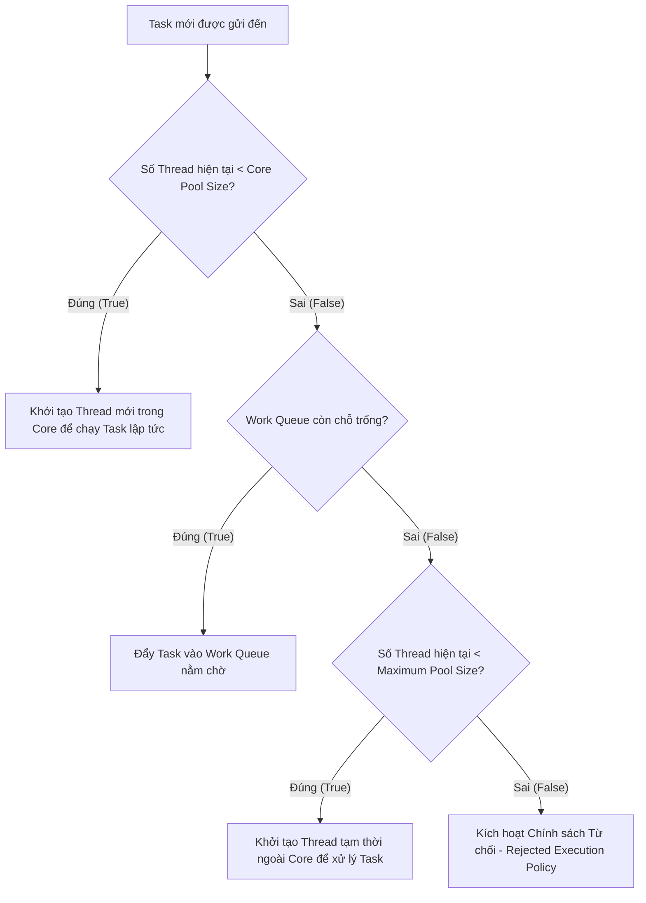

# Tổng Hợp Toàn Bộ Kiến Thức Chuyên Sâu Về Thread Pool

Tài liệu này tổng hợp toàn bộ bản chất cốt lõi, luồng vận hành ngầm (under the hood), phân tích vòng đời, thuật toán điều phối, và tư duy thiết kế hệ thống thực tế liên quan đến **Thread Pool**.

---

## 🧱 1. Khái Niệm & Tư Duy Thiết Kế (The Core Concept)

### ❌ Khi Không Sử Dụng Thread Pool
Mỗi khi có một tác vụ (Task/Request) gửi đến hệ thống, application code (mã lập trình viên code) sẽ gọi new Thread() để yêu cầu JVM tạo một Thread mới thực thi tác vụ. Sau khi hoàn thành, Thread sẽ kết thúc.

**Lưu ý**: `new Thread()` chỉ tạo đối tượng Thread; khi gọi `start()`, JVM sẽ tạo và lập lịch luồng thực thi ở mức hệ điều hành.  

* **Hệ quả:**
    * **Tốn chi phí (Expensive Overhead):** Khởi tạo một thread ở tầng hệ điều hành (OS-level thread) rất đắt đỏ. Nó yêu cầu cấp phát bộ nhớ Stack (mặc định khoảng $1 \\text{ MB}$ trong Java), đăng ký luồng với OS Scheduler.
    * **Context Switching:** Nếu có $10,000$ request ùa vào cùng lúc, hệ thống tạo $10,000$ threads. CPU sẽ mất phần lớn thời gian để nhảy qua nhảy lại giữa các luồng (Chuyển ngữ cảnh) thay vì thực sự xử lý công việc, dẫn đến hiện tượng nghẽn mạch (Thrashing).
    * **Rủi ro sập nguồn:** Cạn kiệt tài nguyên RAM gây lỗi `java.lang.OutOfMemoryError: unable to create new native thread`.

###  Khi Sử Dụng Thread Pool
Thread Pool áp dụng tư duy quản lý tài nguyên cố định (giống như việc thuê sẵn một đội ngũ nhân viên cố định cho quán cà phê). Thay vì hủy thread sau khi xong việc, Thread Pool **giữ sống luồng** và đưa nó về trạng thái chờ (`WAITING`) để tái sử dụng cho các tác vụ tiếp theo.
* **Lợi ích:** Tối ưu hiệu năng, kiểm soát được giới hạn chịu tải tối đa của hệ thống, ngăn ngừa việc sập Server do quá tải request.

---

## ⚙️ 2. Cấu Trúc Thành Phần & Thứ Tự Ưu Tiên

Một Thread Pool tiêu chuẩn (như `ThreadPoolExecutor` trong Java) được cấu thành từ 3 thành phần chính hoạt động phối hợp:

1.  **Core Pool Size (Số luồng lõi):** Số lượng thread tối thiểu luôn được giữ sống trong pool kể từ khi được kích hoạt.
2.  **Work Queue (Hàng đợi công việc):** Nơi chứa các tác vụ đang chờ được xử lý khi tất cả các core threads đều đang bận. Đây là một `BlockingQueue`.
3.  **Maximum Pool Size (Số luồng tối đa):** Giới hạn số luồng tối đa (bao gồm Core Threads + Temporary Threads) mà pool được phép mở rộng khi hàng đợi đã đầy nghẹt.

### 📌 Thứ Tự Điều Phối Nhiệm Vụ (Luồng Ưu Tiên Quyết Định)
Rất nhiều lập trình viên nhầm lẫn rằng hệ thống sẽ mở rộng Thread lên đến `Maximum Pool Size` trước rồi mới đưa vào Queue. Thực tế, thứ tự nghiêm ngặt là:

$$\\text{Core Threads} \\longrightarrow \\text{Work Queue (Hàng đợi)} \\longrightarrow \\text{Max Threads (Luồng tạm thời)} \\longrightarrow \\text{Reject Policy (Từ chối)}$$

---

## 🔄 3. Sơ Đồ Luồng Vận Hành Chi Tiết (Execution Flow)

Quy trình xử lý một Task mới khi được nộp (`submit/execute`) vào Thread Pool diễn ra theo các bước logic sau:

