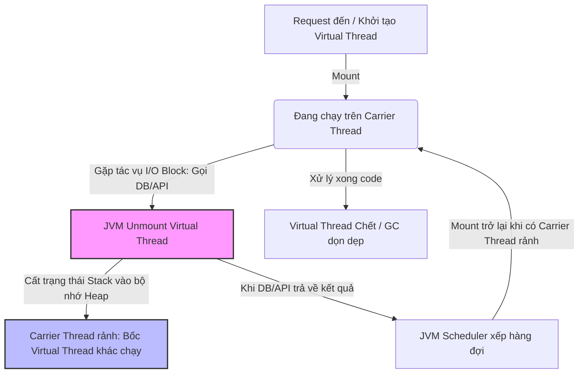

# 📌 Module: Concurrency - Virtual Threads (Project Loom)

## 1. Động lực & Mục tiêu (The Motivation)

- **Bối cảnh & Vấn đề:** 
  Trước Java 21, các Web Framework phổ biến (như Spring Boot với nhúng Tomcat mặc định) sử dụng mô hình **Thread-per-Request** (Mỗi request chiếm trọn một Platform Thread). Bản chất Platform Thread liên kết tỷ lệ $1:1$ với OS Thread, ngốn khoảng **1MB RAM/thread** cho call stack. 
  
  Khi ứng dụng thực hiện các tác vụ nghẽn I/O (gọi Database, gọi Third-party API mất 100-200ms), Platform Thread này phải "đứng im nằm ngủ". Khi số lượng request đồng thời tăng cao (vài nghìn đến hàng vạn), hệ thống sẽ cạn kiệt tài nguyên: ứng dụng nổ lỗi **Out Of Memory (OOM)** do cạn RAM, hoặc CPU bị quá tải trầm trọng do Hệ điều hành phải liên tục thực hiện **Context Switch** (gạt thread cũ, bốc thread mới luân phiên). Để giải quyết, lập trình viên buộc phải viết code Reactive (WebFlux) rất phức tạp, khó debug và khó bảo trì.

- **Mục tiêu cốt lõi:**
  Làm chủ tư duy lập trình đồng hành (Concurrency) thời đại mới: Tạo ra hàng triệu luồng xử lý đồng thời trên phần cứng thông thường mà không làm sập hệ thống. Tự tin thiết kế các ứng dụng Web/API có độ chịu tải (Throughput) cực cao bằng phong cách code tuần tự (Imperative style) quen thuộc, dễ đọc, dễ gỡ lỗi (debug).

---

## 2. Quy tắc cuộc chơi & Trạng thái an toàn (Core Rules & Safety)

### A. Trạng thái cần duy trì (What to keep safe?)
- **Giới hạn tài nguyên (Resource Constraints):** Khác với Platform Thread, Virtual Thread cực kỳ nhẹ (chỉ tốn **vài trăm byte đến vài KB** trên bộ nhớ Heap). Mục tiêu an toàn ở đây không còn là "tiết kiệm số lượng thread" nữa, mà là quản lý các tài nguyên ngoại vi đứng sau nó (ví dụ: Số lượng connection đến Database). Nếu mở 100.000 Virtual Thread mà cạn kiệt Connection Pool của DB thì hệ thống vẫn sập như thường.
- **Tính toàn vẹn dữ liệu / Thread-Safety:** Dù là "ảo", Virtual Thread vẫn là Thread. Khi nhiều Virtual Thread cùng truy cập và thay đổi một trạng thái chung (Shared State), hiện tượng **Race Condition** vẫn xảy ra y hệt thread truyền thống.

### B. Cơ chế kiểm soát (How to control?)
- **Giải pháp kỹ thuật sử dụng:** 
  - **KHÔNG POOL VIRTUAL THREAD:** Tuyệt đối không dùng `ExecutorService` cố định (như FixedThreadPool) để tái sử dụng Virtual Thread. Cơ chế đúng là: Cứ có request/task thì tạo mới (`Thread.ofVirtual().start()`), dùng xong để Garbage Collector (GC) tự dọn dẹp.
  - **Sử dụng <abbr title="Giới hạn số tác vụ chạy đồng thời bằng permit; không quản lý thread.">
Semaphore
</abbr> thay cho Thread Pool:** Để giới hạn số lượng tác vụ đồng thời truy cập vào một tài nguyên (ví dụ: chỉ cho phép tối đa 50 thread gọi vào một API chậm), ta dùng `java.util.concurrent.Semaphore`.
  - **Hạn chế `synchronized` ở các đoạn code I/O dài:** Thay thế bằng `ReentrantLock` để tránh hiện tượng **Thread Pinning** (Virtual Thread bị "dính chặt" vào OS Thread, không gỡ ra được khi gặp block).
- **Đánh đổi (Trade-offs):** 
  Virtual Thread hy sinh hiệu năng xử lý các tác vụ nặng về tính toán (CPU-bound). Nếu dùng Virtual Thread để chạy các thuật toán mã hóa, xử lý ảnh, tính toán AI... nó không những không nhanh hơn mà còn mất thêm một chút chi phí quản lý của JVM quản lý các Continuation.

---

## 3. Kiến trúc & Luồng vận hành (Architecture & Lifecycle)

Cơ chế cốt lõi của Virtual Thread dựa trên mô hình **M:N**. Trong đó $M$ Virtual Threads (do JVM quản lý hoàn toàn nội bộ) được lập lịch chạy luân phiên trên $N$ Carrier Threads (Platform Threads/OS Threads thật, số lượng mặc định bằng số lõi CPU).

## 4. Tư duy dài hạn: Linh hoạt & Hiệu năng (Extensibility & Performance)

- **Mức độ đóng gói / Phụ thuộc:**
  Virtual Thread kế thừa hoàn toàn từ class lớp cha `java.lang.Thread`. Nhờ vậy, nó có tính tương thích ngược hoàn hảo. Bạn dễ dàng nâng cấp một hệ thống cũ lên Virtual Thread chỉ bằng cách cấu hình lại bộ `Executor` cung cấp Thread cho Framework (ví dụ: Cấu hình `TomcatProtocolHandler` trong Spring Boot sử dụng `Executors.newVirtualThreadPerTaskExecutor()`) mà không phải sửa một dòng code logic nào.

- **Khả năng mở rộng (Scalability):**
  Thiết kế này giúp dỡ bỏ hoàn toàn điểm nghẽn (bottleneck) ở tầng Thread ứng dụng. Hệ thống có thể scale tuyến tính theo lưu lượng mạng. Giới hạn chịu tải lúc này dịch chuyển từ "Ứng dụng chịu được bao nhiêu request đồng thời?" sang "Database/Hạ tầng mạng chịu được bao nhiêu kết nối đồng thời?".

- **Nguyên lý cốt lõi áp dụng:**
  Áp dụng triệt để nguyên lý **KISS (Keep It Simple, Stupid)**. Project Loom ra đời để triệt tiêu sự phức tạp của lập trình bất đồng bộ (Reactive Programming). Code của bạn quay trở lại dạng viết tuần tự từ trên xuống dưới, dễ viết khối lệnh `try-catch` bọc lỗi, dễ đọc `Stack Trace` khi có Exception.

---

## 5. Thực nghiệm & Biện hộ (Validation & Proof)

- **Kịch bản kiểm thử (Test Cases):**
  - **Giả lập I/O Block diện rộng:** Tạo một API có lệnh `Thread.sleep(200)` (giả lập gọi API bên thứ ba mất 200ms). Dùng công cụ test tải (như JMeter hoặc k6) bắn đồng thời 10.000 requests/giây vào hệ thống.
  - **Kiểm thử lọt luồng (Pinning Detection):** Chạy ứng dụng với tham số JVM: `-Djdk.tracePinnedThreads=short` hoặc `-Djdk.tracePinnedThreads=full`. Nếu có đoạn code nào dùng `synchronized` gây nghẽn và làm hỏng cơ chế gỡ (unmount) của Virtual Thread, JVM sẽ in ngay log cảnh báo ra console.

- **Dấu hiệu nhận biết "Hệ thống khỏe mạnh":**
  - Xem biểu đồ Monitor (Grafana/Prometheus): Số lượng OS Thread của ứng dụng duy trì ổn định ở mức rất thấp (thường bằng số lượng lõi CPU + một vài thread hệ thống, tổng cộng dưới 100 thread).
  - Biểu đồ RAM phẳng, không xuất hiện các cột nhọn tăng đột biến khi lượng request tăng.
  - CPU Usage tiêu hao cho các tác vụ có ích (xử lý logic) chứ không bị tốn cho `sys` CPU (Context Switch của Hệ điều hành thấp).

---

## 6. Câu hỏi phản biện (The "Why" Questions)

- **Q1: Có giải pháp thay thế nào dễ làm hơn không? Tại sao tôi lại từ chối nó để chọn cách này?**
  - *Trả lời:* Có, giải pháp cũ là tăng số lượng Thread trong Thread Pool của Tomcat lên (ví dụ tăng từ 200 lên 2000). Tôi từ chối vì cách này ngốn quá nhiều RAM (2000 thread = 2GB RAM tĩnh chỉ để giữ chỗ) và khiến CPU quá tải vì Context Switch khi chịu tải thật. Giải pháp thứ hai là dùng Spring WebFlux (Reactive). Tôi từ chối vì WebFlux làm thay đổi hoàn toàn phong cách viết code, rất khó học, phá vỡ các thư viện truyền thống (như JDBC/Hibernate cũ) và cực kỳ khó debug khi có lỗi. Virtual Thread cho hiệu năng tương đương WebFlux nhưng giữ được code sạch và đơn giản.

- **Q2: Điểm yếu chí mạng của giải pháp tôi vừa chọn là gì?**
  - *Trả lời:* Đó là hiện tượng **Thread Pinning** và nguy cơ làm sập hệ thống hạ tầng phía sau. Nếu ứng dụng sử dụng quá nhiều thư viện cũ có các khối lệnh `synchronized` bọc ngoài các tác vụ I/O nặng, Virtual Thread sẽ bị "khóa chặt" vào Carrier Thread. Lúc này hệ thống quay trở lại cơ chế 1:1 cũ, tệ hơn là số lượng Carrier Thread rất ít (bằng số lõi CPU), dẫn đến toàn bộ ứng dụng bị đóng băng (Starvation). Ngoài ra, việc tạo thread quá dễ dàng dễ khiến lập trình viên chủ quan, vô tình spam hàng triệu truy vấn làm nổ tung Database phía sau.

- **Q3: Nếu một Junior vào đọc code này, họ dễ làm sai ở chỗ nào nhất?**
  - *Trả lời:* Junior rất dễ quen tay tạo một `ExecutorService` dạng Pool (ví dụ: `Executors.newFixedThreadPool(200)`) rồi cố nhét Virtual Thread vào đó để tái sử dụng. Họ cũng dễ nhầm lẫn rằng Virtual Thread làm thuật toán chạy nhanh hơn và đem áp dụng nó vào các hàm xử lý logic, tính toán dữ liệu nặng, dẫn đến giảm hiệu năng hệ thống.

---

## 7. Đúc kết hành động

- **Bài học tâm đắc (Insight):**
  > *“Thread trong Java từ nay về sau chỉ là một đơn vị logic để thực thi code, không còn là một tài nguyên phần cứng đắt đỏ phải căn ke từng chút một.”*

- **Điểm sáng áp dụng:**
  Áp dụng ngay vào các tính năng như: Gửi Mail hàng loạt, Export báo cáo Excel nặng, gọi chuỗi API sang các đối tác bên thứ ba, hoặc tích hợp trực tiếp vào cấu hình luồng xử lý Request của dự án Web đang làm để tăng khả năng chịu tải mà không tốn tiền mua thêm RAM cho Server.

- **Vùng mờ (The Blindspot):**
  Cần đào sâu tìm hiểu kỹ hơn về cơ chế quản lý bộ nhớ của JVM (Garbage Collection) phản ứng thế nào khi hàng triệu Virtual Thread liên tục sinh ra và chết đi trong một giây, và cách cấu hình các thư viện ORM như Hibernate/JPA chạy an toàn tối đa trong môi trường Virtual Thread.

# To learn later
- Hạn chế khi sử dụng synchronized` ở các đoạn code I/O dài:**
- Vì sao không dùng `Virtual Thread ` cho những tác vụ nặng về tính toán